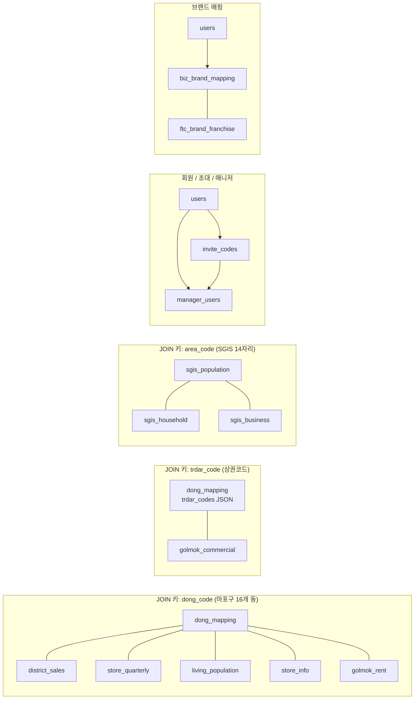
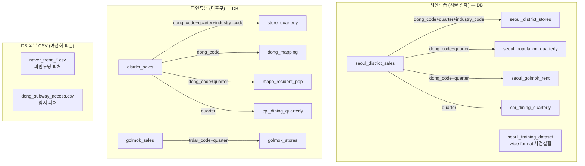
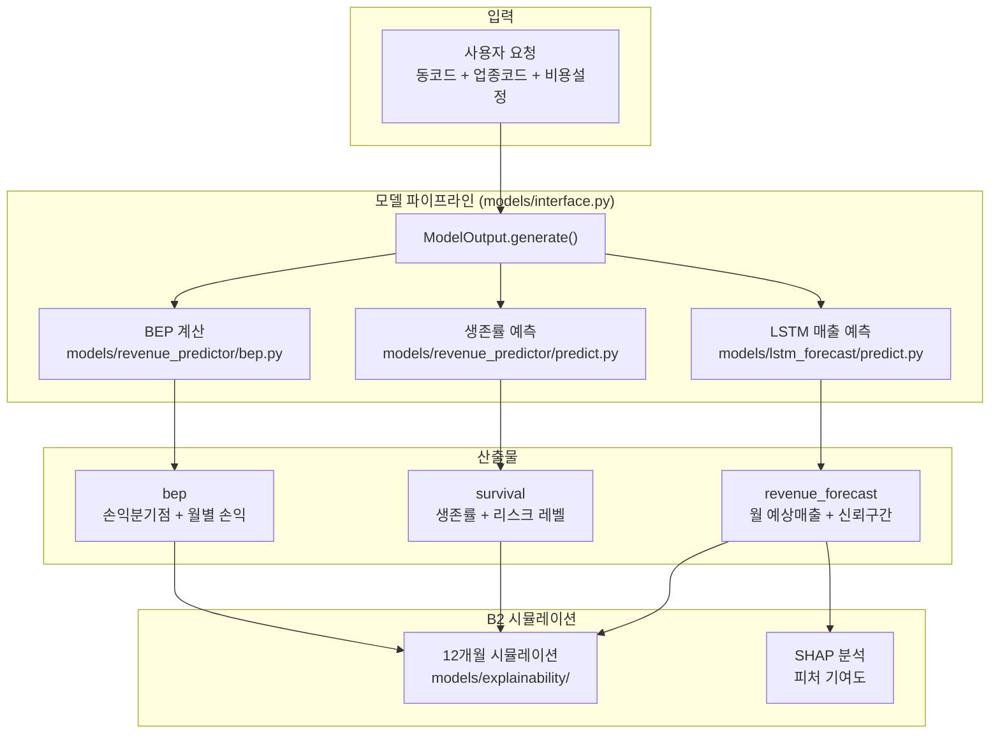

# 마포구 프랜차이즈 상권분석 시뮬레이터 — DB ERD

> DB: `mapo_simulator` | 29개 테이블 (애플리케이션 ORM)
> 출처: `backend/src/database/models.py` + Alembic 마이그레이션 (rev b2d4e8f1c7a3)
> 최종 갱신: 2026-04-17

---

## ER 다이어그램

```mermaid
erDiagram
    %% ========================================
    %% 매출 / 점포 / 상권
    %% ========================================

    district_sales {
        int quarter PK "분기(YYYYQ)"
        varchar dong_code PK "행정동코드"
        varchar industry_code PK "업종코드"
        varchar dong_name "행정동명"
        varchar industry_name "업종명"
        bigint monthly_sales "월매출"
        int monthly_count "월건수"
        bigint weekday_sales "평일매출"
        bigint weekend_sales "주말매출"
        bigint mon_sales "요일별 매출(7개)"
        bigint time_00_06_sales "시간대별 매출(6개)"
        bigint male_sales "성별 매출(2개)"
        bigint age_10_sales "연령대별 매출(6개)"
    }

    store_quarterly {
        int quarter PK "분기"
        varchar dong_code PK "행정동코드"
        varchar industry_code PK "업종코드"
        varchar dong_name "행정동명"
        varchar industry_name "업종명"
        int store_count "점포수"
        int open_count "개업수"
        int close_count "폐업수"
        float closure_rate "폐업률(%)"
        int franchise_count "프랜차이즈수"
    }

    golmok_commercial {
        int id PK "auto"
        int quarter "분기"
        varchar trdar_code "상권코드"
        varchar data_type "데이터유형"
        varchar industry_code "업종코드"
        jsonb metrics "지표(JSON)"
    }

    store_info {
        varchar store_id PK "상가업소번호"
        varchar store_name "상호명"
        varchar dong_code "행정동코드"
        varchar dong_name "행정동명"
        text address "지번주소"
        text road_address "도로명주소"
        float lat "위도"
        float lon "경도"
        varchar industry_l_code "대분류"
        varchar industry_m_code "중분류"
        varchar industry_s_code "소분류"
    }

    %% ========================================
    %% 마스터
    %% ========================================

    dong_mapping {
        varchar dong_code PK "행정동코드"
        varchar dong_name "행정동명"
        int resident_pop "주민등록인구"
        float floating_pop "유동인구"
        float avg_age "평균연령"
        int total_households "총가구수"
        jsonb trdar_codes "상권코드목록"
    }

    %% ========================================
    %% 임대료
    %% ========================================

    rent_cost {
        int id PK "auto"
        varchar data_type "유형(building_rent/transaction)"
        varchar area_name "지역명"
        smallint year "연도"
        smallint quarter "분기"
        float rent "임대료"
        float vacancy_rate "공실률"
    }

    golmok_rent {
        int id PK "auto"
        smallint year "연도"
        smallint quarter "분기"
        varchar dong_code "행정동코드"
        varchar dong_name "행정동명"
        varchar gubun "구분(gu/dong)"
        int rent_1f "1층임대료"
        int rent_other "기타층임대료"
        int rent_total "전체임대료"
    }

    %% ========================================
    %% 인구
    %% ========================================

    living_population {
        date date PK "날짜"
        smallint time_zone PK "시간대"
        varchar dong_code PK "행정동코드"
        varchar dong_name "행정동명"
        float total_pop "총생활인구"
    }

    sgis_population {
        smallint year PK "연도"
        varchar area_code PK "지역코드(14자리)"
        varchar indicator PK "지표명"
        float value "값"
    }

    sgis_household {
        smallint year PK "연도"
        varchar area_code PK "지역코드"
        varchar indicator PK "지표명"
        float value "값"
    }

    sgis_business {
        smallint year PK "연도"
        varchar area_code PK "지역코드"
        varchar indicator PK "지표명"
        float value "값"
    }

    %% ========================================
    %% 시뮬레이션 / 회원 / 인증
    %% ========================================

    simulation_result {
        uuid request_id PK "요청ID"
        date created_at "생성일"
        varchar workspace_id "워크스페이스"
        jsonb input_params "입력파라미터"
        jsonb output_result "출력결과"
        varchar status "상태"
    }

    users {
        uuid id PK "회원ID"
        varchar company_name "기업명"
        varchar biz_number UK "사업자등록번호"
        varchar contact_name "담당자명"
        varchar email UK "이메일"
        varchar phone "연락처"
        int store_count "가맹점수"
        varchar password_hash "비번해시"
        varchar plan "요금제"
        bool agree_terms "약관동의"
        timestamptz created_at "가입일시"
    }

    invite_codes {
        int id PK "auto"
        varchar code UK "초대코드(8자리)"
        uuid owner_id FK "팀장ID"
        int max_uses "최대사용수"
        int used_count "사용된수"
        bool is_active "활성여부"
        timestamptz expires_at "만료일시"
    }

    manager_users {
        uuid id PK "매니저ID"
        uuid owner_id FK "팀장ID"
        int invite_code_id FK "초대코드ID"
        varchar contact_name "이름"
        varchar email UK "이메일"
        varchar phone "연락처"
        bool is_active "활성여부"
        bool is_approved "승인여부"
        varchar assigned_gu "담당구"
        json assigned_dongs "담당동배열"
    }

    %% ========================================
    %% 브랜드
    %% ========================================

    ftc_brand_franchise {
        int id PK "auto"
        smallint yr "연도"
        varchar corpNm "법인명"
        varchar brandNm "브랜드명"
        varchar indutyLclasNm "업종대분류"
        varchar indutyMlsfcNm "업종중분류"
        int frcsCnt "가맹점수"
        bigint avrgSlsAmt "평균매출(천원)"
    }

    biz_brand_mapping {
        varchar biz_number PK "사업자등록번호"
        varchar company_name "기업명"
        varchar brand_name "브랜드명"
        varchar industry_large "업종대분류"
        varchar industry_medium "업종중분류"
        int franchise_count "전국가맹점수"
        bigint avg_sales "평균매출"
        int mapo_store_count "마포구점포수"
    }

    %% ========================================
    %% 외부 수집
    %% ========================================

    naver_vacancy {
        int id PK "auto"
        varchar trade_type "거래유형"
        varchar trade_code "거래코드"
        float lat "위도"
        float lon "경도"
        int listing_count "매물건수"
        varchar dong_name "행정동명"
        timestamptz collected_at "수집일시"
    }

    kakao_store {
        varchar kakao_id PK "카카오장소ID"
        varchar place_name "장소명"
        varchar brand_name "브랜드명"
        varchar category "10대업종"
        varchar dong_name "행정동명"
        float lat "위도"
        float lon "경도"
        timestamptz collected_at "수집일시"
    }

    brand_logo {
        varchar brand_name PK "브랜드명"
        varchar domain "공식도메인"
        text logo_url "로고URL"
        varchar logo_source "수집소스"
        timestamptz collected_at "수집일시"
    }

    %% ========================================
    %% 마포구 보조 데이터
    %% ========================================

    golmok_sales {
        int id PK "auto"
        bigint quarter "분기"
        text trdar_code "상권코드"
        text industry_code "업종코드"
        bigint monthly_sales "월매출"
        bigint monthly_count "월건수"
    }

    golmok_stores {
        int id PK "auto"
        bigint quarter "분기"
        text trdar_code "상권코드"
        text industry_code "업종코드"
        bigint store_count "점포수"
        bigint franchise_count "프랜차이즈수"
        bigint close_count "폐업수"
    }

    mapo_resident_pop {
        int id PK "auto"
        bigint quarter "분기"
        text dong_code "행정동코드"
        text dong_name "행정동명"
        float resident_pop "주민등록인구"
    }

    cpi_dining_quarterly {
        int id PK "auto"
        bigint quarter "분기"
        float cpi_index "외식CPI"
    }

    %% ========================================
    %% 서울 전체 (LSTM 사전학습)
    %% ========================================

    seoul_district_sales {
        int id PK "auto"
        bigint quarter "분기"
        text dong_code "행정동코드"
        text industry_code "업종코드"
        bigint monthly_sales "월매출"
        bigint monthly_count "월건수"
    }

    seoul_district_stores {
        int id PK "auto"
        bigint quarter "분기"
        text dong_code "행정동코드"
        text industry_code "업종코드"
        bigint store_count "점포수"
        bigint franchise_count "프랜차이즈수"
    }

    seoul_golmok_rent {
        int id PK "auto"
        bigint year "연도"
        bigint quarter "분기"
        text dong_code "행정동코드"
        float rent_1f "1층임대료"
        float rent_total "전체임대료"
    }

    seoul_population_quarterly {
        int id PK "auto"
        bigint quarter "분기"
        text dong_code "행정동코드"
        float total_pop "인구"
    }

    seoul_training_dataset {
        int id PK "auto"
        bigint quarter "분기"
        text dong_code "행정동코드"
        text industry_code "업종코드"
        bigint monthly_sales "월매출"
        bigint store_count "점포수"
        float total_pop "인구"
        float cpi_index "외식CPI"
    }

    %% ========================================
    %% 관계
    %% ========================================

    district_sales ||--|| store_quarterly : "quarter+dong_code+industry_code"
    district_sales }o--|| dong_mapping : "dong_code"
    store_quarterly }o--|| dong_mapping : "dong_code"
    store_info }o--|| dong_mapping : "dong_code"
    living_population }o--|| dong_mapping : "dong_code"
    golmok_rent }o--|| dong_mapping : "dong_code"
    dong_mapping ||--o{ golmok_commercial : "trdar_codes(JSON) → trdar_code"

    users ||--o{ invite_codes : "owner_id"
    users ||--o{ manager_users : "owner_id"
    invite_codes ||--o{ manager_users : "invite_code_id"

    users ||--o| biz_brand_mapping : "biz_number"
    biz_brand_mapping }o--o{ ftc_brand_franchise : "brand_name (FTC 매핑)"

    biz_brand_mapping }o--o| brand_logo : "brand_name"
    dong_mapping ||--o{ mapo_resident_pop : "dong_code(text)"
    dong_mapping ||--o{ golmok_sales : "trdar_code"
    dong_mapping ||--o{ golmok_stores : "trdar_code"
    seoul_district_sales ||--|| seoul_district_stores : "dong_code+quarter+industry_code"
    seoul_district_sales }o--|| seoul_population_quarterly : "dong_code+quarter"
    seoul_district_sales }o--|| seoul_golmok_rent : "dong_code+quarter"
    seoul_district_sales }o--|| cpi_dining_quarterly : "quarter"
    seoul_training_dataset }o--|| cpi_dining_quarterly : "quarter (pre-joined)"
```



---

## 테이블 간 관계 상세

### JOIN 키 기준 관계도



### 관계 유형별 정리

#### 1. 행정동(dong_code) 기준 — 핵심 관계

| 관계 | JOIN 키 | 관계 유형 | 설명 |
|------|---------|----------|------|
| dong_mapping ↔ district_sales | dong_code | 1:N | 1동 → 여러 분기×업종 매출 |
| dong_mapping ↔ store_quarterly | dong_code | 1:N | 1동 → 여러 분기×업종 점포수 |
| dong_mapping ↔ living_population | dong_code | 1:N | 1동 → 여러 일×시간대 유동인구 |
| dong_mapping ↔ store_info | dong_code | 1:N | 1동 → 여러 개별 매장 |
| dong_mapping ↔ golmok_rent | dong_code | 1:N | 1동 → 여러 분기 임대료 |

#### 2. 행정동+분기+업종 — 매출-점포 결합

| 관계 | JOIN 키 | 관계 유형 | 설명 |
|------|---------|----------|------|
| district_sales ↔ store_quarterly | dong_code + quarter + industry_code | 1:1 | 같은 동×분기×업종의 매출과 점포수 |

#### 3. 상권코드(trdar_code) — 골목상권 관계

| 관계 | JOIN 키 | 관계 유형 | 설명 |
|------|---------|----------|------|
| dong_mapping → golmok_commercial | trdar_codes(JSONB) → trdar_code | 1:N | 1동에 여러 상권 매핑 |

> `golmok_commercial`은 `data_type` 컬럼으로 (sales / store / population / index / change) 구분된 단일 long-format 테이블. metrics는 JSONB로 동적 컬럼 저장.

#### 4. 지역코드(area_code) — SGIS 통계

| 관계 | JOIN 키 | 관계 유형 | 설명 |
|------|---------|----------|------|
| sgis_population ↔ sgis_household | area_code + year | N:N | 같은 지역의 인구와 가구 통계 |
| sgis_population ↔ sgis_business | area_code + year | N:N | 같은 지역의 인구와 사업체 통계 |

> 참고: SGIS의 `area_code`(소지역 14자리)와 `dong_code`(행정동 8자리)는 코드 체계가 다릅니다. 매핑은 별도 처리.

#### 5. 회원 / 초대 / 매니저 (FK 명시)

| 관계 | FK | 관계 유형 | 설명 |
|------|----|----------|------|
| users → invite_codes | invite_codes.owner_id (CASCADE) | 1:N | 팀장이 여러 초대코드 발급 |
| users → manager_users | manager_users.owner_id (CASCADE) | 1:N | 팀장이 여러 매니저 보유 |
| invite_codes → manager_users | manager_users.invite_code_id | 1:N | 초대코드별 가입 매니저 |

#### 6. 브랜드 매핑

| 관계 | JOIN 키 | 관계 유형 | 설명 |
|------|---------|----------|------|
| users ↔ biz_brand_mapping | biz_number | 1:1 | 가입 시 사업자번호 → 브랜드 매핑 |
| biz_brand_mapping ↔ ftc_brand_franchise | brand_name (LIKE) | N:N | 브랜드명 기반 FTC 정보 조회 |

---

## ML 학습 시 JOIN 흐름



> 기존 사전학습용 CSV 데이터셋은 migration `b2d4e8f1c7a3` 에서 DB 테이블로 승격됨.
> 최초 적재: `python -m scripts.init_db --csv-dir <폴더>` (원클릭).
> 업데이트 동기화: `python -m scripts.seed_from_csv --force` (앱 데이터 보호) / `--force-all` (전면 교체).
> 자세한 셋업 가이드는 `docs/db-schema.md` 의 "최초 셋업" 섹션 참조.

---

## 테이블 요약

| 구분 | 테이블 | PK | 인덱스 | 비고 |
|------|--------|-----|--------|------|
| **마스터** | dong_mapping | dong_code | - | 마포구 16동 |
| **매출** | district_sales | (quarter, dong_code, industry_code) | dong_code | 50+ 컬럼 (요일/시간/성/연령) |
| **점포** | store_quarterly | (quarter, dong_code, industry_code) | dong_code | 분기별 집계 |
| | store_info | store_id | dong_code, dong_name, industry_m | 개별 매장 |
| **상권** | golmok_commercial | id (auto) | quarter, data_type | long-format + JSONB metrics |
| **인구** | living_population | (date, time_zone, dong_code) | - | 일별 시간대별 |
| | sgis_population | (year, area_code, indicator) | - | SGIS 14자리 코드 |
| | sgis_household | (year, area_code, indicator) | - | |
| | sgis_business | (year, area_code, indicator) | - | |
| **임대료** | rent_cost | id (auto) | data_type | 빌딩/소형점포/실거래 |
| | golmok_rent | id (auto) | year, dong_code | 환산임대료 |
| **시뮬레이션** | simulation_result | request_id (uuid) | workspace_id | jsonb 입출력 |
| **회원** | users | id (uuid) | email | 팀장 |
| | manager_users | id (uuid) | email, owner_id | 매니저 (담당구/동) |
| | invite_codes | id (auto) | code (UNIQUE) | FK→users |
| **브랜드** | ftc_brand_franchise | id (auto) | yr, brandNm | 공정위 정보공개서 |
| | biz_brand_mapping | biz_number | - | 회원-브랜드 매핑 |
| **외부 수집** | naver_vacancy | id (auto) | dong_name | 부동산 매물 |
| | kakao_store | kakao_id | brand_name, category, dong_name | 실시간 점포 |
| | brand_logo | brand_name | - | 브랜드 로고 URL |
| **마포 보조** | golmok_sales | id (auto) | quarter, trdar_code | 골목상권 분기 매출 |
| | golmok_stores | id (auto) | quarter, trdar_code | 골목상권 분기 점포 |
| | mapo_resident_pop | id (auto) | quarter, dong_code | 주민등록 인구 |
| | cpi_dining_quarterly | id (auto) | - | 외식 CPI |
| **서울 사전학습** | seoul_district_sales | id (auto) | quarter, dong_code | 서울 전체 행정동 매출 |
| | seoul_district_stores | id (auto) | quarter, dong_code | 서울 전체 점포 |
| | seoul_population_quarterly | id (auto) | quarter, dong_code | 서울 분기 인구 |
| | seoul_golmok_rent | id (auto) | year, dong_code | 서울 환산임대료 |
| | seoul_training_dataset | id (auto) | quarter, dong_code | LSTM 사전학습 통합셋 |

> 추가로 `alembic_version` (마이그레이션 추적), `langchain_pg_collection` / `langchain_pg_embedding` (RAG 벡터 DB)는 ORM 외부에서 관리됩니다.

---

## 모델 산출물 구조

### 전체 파이프라인 흐름



### ModelOutput.generate() 산출물 상세

`models/interface.py`의 `ModelOutput.generate(dong_code, industry_code, industry_name, cost_config)` 호출 시 아래 구조의 dict를 반환합니다.

```json
{
  "input": {
    "dong_code": "11440680",
    "dong_name": "합정동",
    "industry_code": "CS100010",
    "industry_name": "커피-음료"
  },

  "revenue_forecast": {
    "monthly_avg": 47200000,
    "monthly_predictions": [
      {"month": 1, "predicted_sales": 45000000, "confidence_lower": 38000000, "confidence_upper": 52000000}
    ]
  },

  "survival": {
    "survival_rate": 0.72,
    "risk_level": "safe",
    "monthly_survival_rates": [0.97, 0.94, 0.91, 0.88, 0.86, 0.83, 0.81, 0.78, 0.76, 0.74, 0.72, 0.70]
  },

  "bep": {
    "bep_months": 18,
    "monthly_profit": 2800000,
    "total_initial_investment": 130000000,
    "annual_roi": 25.8,
    "monthly_simulation": [
      {"month": 1, "revenue": 45000000, "cost": 42200000, "profit": 2800000, "cumulative_profit": -127200000, "bep_reached": false}
    ]
  },

  "metadata": {
    "model_version": "0.1.0",
    "generated_at": "2026-04-17T12:30:00+00:00",
    "data_period": "2019Q1~2024Q4"
  }
}
```

### 산출물 항목별 설명

#### 1. revenue_forecast (매출 예측)

| 필드 | 타입 | 설명 |
|------|------|------|
| `monthly_avg` | int | 12개월 평균 예상 월매출 (원) |
| `monthly_predictions[].month` | int | 월 (1~12) |
| `monthly_predictions[].predicted_sales` | float | 해당 월 예상매출 (원) |
| `monthly_predictions[].confidence_lower` | float | 95% 신뢰구간 하한 |
| `monthly_predictions[].confidence_upper` | float | 95% 신뢰구간 상한 |

- LSTM/GRU/TCN 모델이 4분기를 예측하고, 각 분기를 3개월로 분배
- 신뢰구간은 ±예측값의 일정 비율로 산출

#### 2. survival (생존률)

| 필드 | 타입 | 설명 |
|------|------|------|
| `survival_rate` | float | 향후 1분기 생존 확률 (0~1) |
| `risk_level` | string | "safe" (≥0.7) / "caution" (≥0.4) / "danger" (<0.4) |
| `monthly_survival_rates` | float[] | 12개월 월별 생존률 (감쇄 곡선) |

#### 3. bep (손익분기점)

| 필드 | 타입 | 설명 |
|------|------|------|
| `bep_months` | int | BEP 도달 예상 개월수 (-1이면 도달 불가) |
| `monthly_profit` | float | 월 순이익 (원) |
| `total_initial_investment` | float | 초기투자 합계 |
| `annual_roi` | float | 연간 ROI (%) |
| `monthly_simulation[]` | array | 월별 매출/비용/손익/BEP 도달 여부 |

- BEP = 초기투자비 / (월매출 - 월고정비 - 월변동비)

#### 4. 비용 구조 (cost_config)

| 업종 | 원가율 | 월 인건비 |
|------|--------|----------|
| 한식음식점 | 35% | 500만원 |
| 중식음식점 | 33% | 450만원 |
| 일식음식점 | 38% | 550만원 |
| 양식음식점 | 35% | 500만원 |
| 제과점 | 30% | 400만원 |
| 패스트푸드점 | 32% | 350만원 |
| 치킨전문점 | 40% | 350만원 |
| 분식전문점 | 30% | 300만원 |
| 호프-간이주점 | 35% | 400만원 |
| 커피-음료 | 25% | 400만원 |

#### 5. Mock 모드

모델 가중치 파일이 없으면 자동으로 mock 데이터를 반환합니다.

### B2가 사용하는 방법

```python
from models.interface import ModelOutput

result = ModelOutput.generate(
    dong_code="11440680",
    industry_code="CS100010",
    industry_name="커피-음료",
    cost_config=None,
)

monthly_sales = result["revenue_forecast"]["monthly_predictions"]
survival = result["survival"]["monthly_survival_rates"]
bep_sim = result["bep"]["monthly_simulation"]
```
