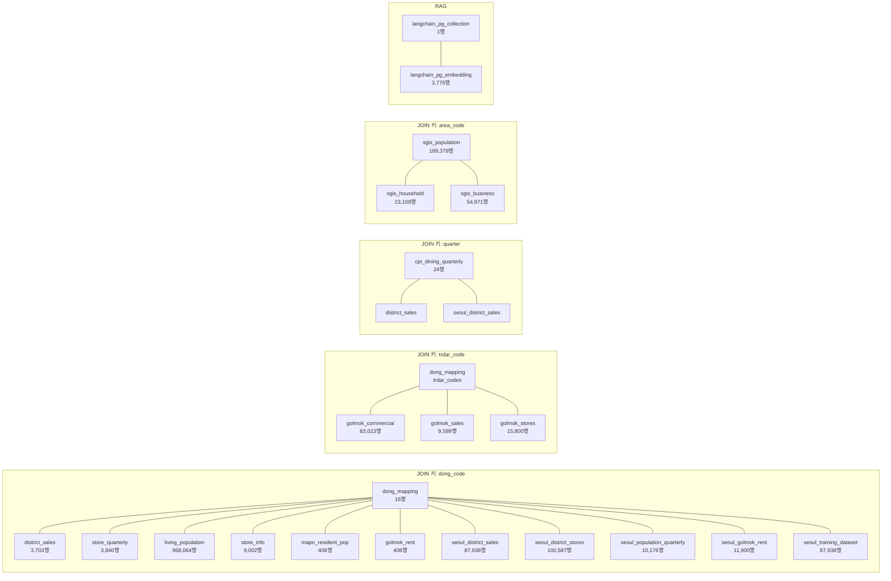
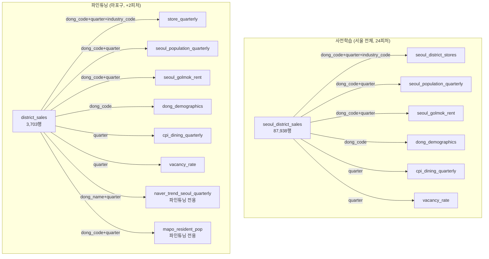
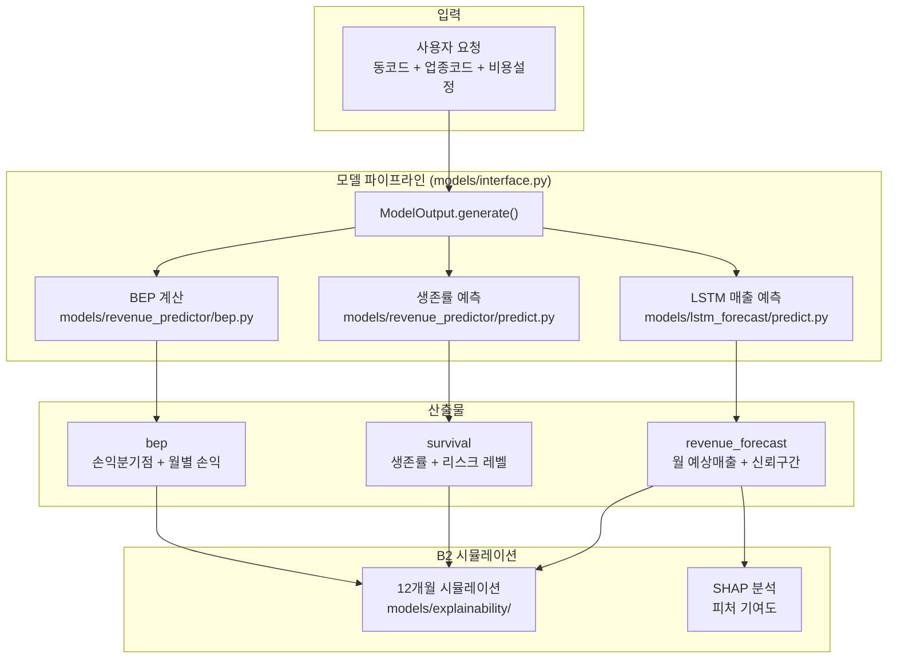

# 마포구 프랜차이즈 상권분석 시뮬레이터 — DB ERD

```mermaid
erDiagram
    %% ========================================
    %% 마포구 핵심 테이블 (파인튜닝 + 서비스용)
    %% ========================================

    district_sales {
        bigint quarter PK "분기 (20191~20244)"
        text dong_code PK "행정동코드"
        text dong_name "행정동명"
        text industry_code PK "업종코드"
        text industry_name "업종명"
        bigint monthly_sales "월매출"
        bigint monthly_count "월건수"
        bigint weekday_sales "주중매출"
        bigint weekend_sales "주말매출"
        bigint male_sales "남성매출"
        bigint female_sales "여성매출"
    }

    store_quarterly {
        bigint quarter PK "분기"
        text dong_code PK "행정동코드"
        text industry_code PK "업종코드"
        text industry_name "업종명"
        bigint store_count "점포수"
        bigint open_count "개업수"
        bigint close_count "폐업수"
        float closure_rate "폐업률(%)"
        bigint franchise_count "프랜차이즈수"
    }

    dong_mapping {
        text dong_code PK "행정동코드"
        text dong_name "행정동명"
        bigint resident_pop "주민등록인구"
        float floating_pop "유동인구"
        float avg_age "평균연령"
        float total_households "총가구수"
        text trdar_codes "상권코드목록(JSON)"
    }

    mapo_resident_pop {
        bigint quarter PK "분기"
        text dong_code PK "행정동코드"
        text dong_name "행정동명"
        float resident_pop "주민등록인구"
    }

    %% ========================================
    %% 서울 전체 테이블 (사전학습용)
    %% ========================================

    seoul_district_sales {
        bigint quarter PK "분기"
        text dong_code PK "행정동코드"
        text dong_name "행정동명"
        text industry_code PK "업종코드"
        bigint monthly_sales "월매출"
        bigint monthly_count "월건수"
    }

    seoul_district_stores {
        bigint quarter PK "분기"
        text dong_code PK "행정동코드"
        text industry_code PK "업종코드"
        bigint store_count "점포수"
        bigint open_count "개업수"
        bigint close_count "폐업수"
    }

    seoul_population_quarterly {
        bigint quarter PK "분기"
        text dong_code PK "행정동코드"
        float total_pop "유동인구(분기평균)"
    }

    seoul_golmok_rent {
        bigint quarter_code PK "분기코드"
        text dong_code PK "행정동코드"
        text dong_name "행정동명"
        float rent_1f "1층임대료"
        float rent_other "기타층임대료"
        float rent_total "전체임대료"
    }

    seoul_training_dataset {
        bigint quarter PK "분기"
        text dong_code PK "행정동코드"
        text industry_code PK "업종코드"
        float monthly_sales "월매출"
        float store_count "점포수"
        float total_pop "유동인구"
        float cpi_index "외식물가지수"
    }

    %% ========================================
    %% 골목상권 테이블 (상권 단위)
    %% ========================================

    golmok_commercial {
        bigint quarter PK "분기"
        text trdar_code PK "상권코드"
        text data_type "데이터유형"
        text industry_code "업종코드"
        text metrics "지표(JSON)"
    }

    golmok_sales {
        bigint quarter PK "분기"
        bigint trdar_code PK "상권코드"
        text industry_code PK "업종코드"
        bigint monthly_sales "월매출"
        bigint monthly_count "월건수"
    }

    golmok_stores {
        bigint quarter PK "분기"
        bigint trdar_code PK "상권코드"
        text industry_code PK "업종코드"
        bigint store_count "점포수"
        bigint open_count "개업수"
        bigint close_count "폐업수"
    }

    golmok_rent {
        bigint quarter PK "분기"
        bigint dong_code PK "행정동코드"
        text dong_name "행정동명"
        text gubun "구분(dong/gu)"
        bigint rent_1f "1층임대료"
    }

    %% ========================================
    %% 인구/통계 테이블
    %% ========================================

    living_population {
        date date PK "날짜"
        bigint time_zone PK "시간대"
        text dong_code PK "행정동코드"
        text dong_name "행정동명"
        float total_pop "총생활인구"
    }

    sgis_population {
        bigint year PK "연도"
        text area_code PK "지역코드"
        text indicator PK "지표명"
        float value "값"
    }

    sgis_household {
        bigint year PK "연도"
        text area_code PK "지역코드"
        text indicator PK "지표명"
        float value "값"
    }

    sgis_business {
        bigint year PK "연도"
        text area_code PK "지역코드"
        text indicator PK "지표명"
        float value "값"
    }

    %% ========================================
    %% 기타 테이블
    %% ========================================

    store_info {
        text store_id PK "상가업소번호"
        text store_name "상호명"
        text dong_code "행정동코드"
        text dong_name "행정동명"
        text address "주소"
        float lat "위도"
        float lon "경도"
    }

    rent_cost {
        text area_name PK "지역명"
        bigint year PK "연도"
        bigint quarter PK "분기"
        float rent "임대료"
        float vacancy_rate "공실률"
    }

    cpi_dining_quarterly {
        bigint quarter PK "분기"
        float cpi_index "외식물가지수"
    }

    langchain_pg_embedding {
        varchar id PK "문서ID"
        uuid collection_id FK "컬렉션ID"
        vector embedding "임베딩벡터(384차원)"
        varchar document "원문텍스트"
        jsonb cmetadata "메타데이터"
    }

    langchain_pg_collection {
        uuid uuid PK "UUID"
        varchar name "컬렉션명"
        json cmetadata "메타데이터"
    }

    simulation_result {
        uuid request_id PK "요청ID"
        date created_at "생성일"
        jsonb input_params "입력파라미터"
        jsonb output_result "출력결과"
        varchar status "상태"
    }

    %% ========================================
    %% 관계 (JOIN 키)
    %% ========================================

    district_sales ||--o{ store_quarterly : "dong_code + quarter + industry_code"
    district_sales }o--|| dong_mapping : "dong_code"
    district_sales }o--|| cpi_dining_quarterly : "quarter"
    district_sales }o--o{ mapo_resident_pop : "dong_code + quarter"

    seoul_district_sales ||--o{ seoul_district_stores : "dong_code + quarter + industry_code"
    seoul_district_sales }o--o{ seoul_population_quarterly : "dong_code + quarter"
    seoul_district_sales }o--o{ seoul_golmok_rent : "dong_code + quarter"
    seoul_district_sales }o--|| cpi_dining_quarterly : "quarter"

    dong_mapping ||--o{ golmok_commercial : "trdar_codes → trdar_code"
    dong_mapping ||--o{ golmok_stores : "trdar_codes → trdar_code"
    dong_mapping ||--o{ golmok_sales : "trdar_codes → trdar_code"

    store_info }o--|| dong_mapping : "dong_code"
    living_population }o--|| dong_mapping : "dong_code"
    golmok_rent }o--|| dong_mapping : "dong_code"

    langchain_pg_embedding }o--|| langchain_pg_collection : "collection_id"
```



## 테이블 간 관계 상세

### JOIN 키 기준 관계도



### 관계 유형별 정리

#### 1. 행정동(dong_code) 기준 — 핵심 관계

| 관계 | JOIN 키 | 관계 유형 | 설명 |
|------|---------|----------|------|
| dong_mapping ↔ district_sales | dong_code | 1:N | 1동 → 여러 분기×업종 매출 |
| dong_mapping ↔ store_quarterly | dong_code | 1:N | 1동 → 여러 분기×업종 점포수 |
| dong_mapping ↔ living_population | dong_code | 1:N | 1동 → 여러 일×시간대 유동인구 |
| dong_mapping ↔ mapo_resident_pop | dong_code | 1:N | 1동 → 여러 분기 주거인구 |
| dong_mapping ↔ store_info | dong_code | 1:N | 1동 → 여러 개별 매장 |
| dong_mapping ↔ golmok_rent | dong_code | 1:N | 1동 → 여러 분기 임대료 |

#### 2. 행정동+분기+업종 — 매출-점포 결합

| 관계 | JOIN 키 | 관계 유형 | 설명 |
|------|---------|----------|------|
| district_sales ↔ store_quarterly | dong_code + quarter + industry_code | 1:1 | 같은 동×분기×업종의 매출과 점포수 |
| seoul_district_sales ↔ seoul_district_stores | dong_code + quarter + industry_code | 1:1 | 서울 전체 동일 관계 |

#### 3. 행정동+분기 — 피처 결합

| 관계 | JOIN 키 | 관계 유형 | 설명 |
|------|---------|----------|------|
| district_sales ↔ mapo_resident_pop | dong_code + quarter | N:1 | 매출에 주거인구 결합 |
| district_sales ↔ seoul_population_quarterly | dong_code + quarter | N:1 | 매출에 유동인구 결합 |
| district_sales ↔ cpi_dining_quarterly | quarter | N:1 | 매출에 물가지수 결합 |
| seoul_district_sales ↔ seoul_golmok_rent | dong_code + quarter | N:1 | 매출에 임대료 결합 |

#### 4. 상권코드(trdar_code) — 골목상권 관계

| 관계 | JOIN 키 | 관계 유형 | 설명 |
|------|---------|----------|------|
| dong_mapping → golmok_commercial | trdar_codes(JSON) → trdar_code | 1:N | 1동에 여러 상권 매핑 |
| golmok_commercial ↔ golmok_sales | trdar_code + quarter + industry_code | 1:1 | 상권별 종합지표와 매출 |
| golmok_commercial ↔ golmok_stores | trdar_code + quarter + industry_code | 1:1 | 상권별 종합지표와 점포수 |

#### 5. 지역코드(area_code) — SGIS 통계

| 관계 | JOIN 키 | 관계 유형 | 설명 |
|------|---------|----------|------|
| sgis_population ↔ sgis_household | area_code + year | N:N | 같은 지역의 인구와 가구 통계 |
| sgis_population ↔ sgis_business | area_code + year | N:N | 같은 지역의 인구와 사업체 통계 |

> 참고: area_code(SGIS)와 dong_code(행정동)는 코드 체계가 다릅니다. SGIS는 소지역 코드(14자리), 행정동은 8자리.

#### 6. RAG 벡터 DB

| 관계 | JOIN 키 | 관계 유형 | 설명 |
|------|---------|----------|------|
| langchain_pg_collection ↔ langchain_pg_embedding | collection_id = uuid | 1:N | 1컬렉션 → 3,775개 법률 문서 청크 |

### LSTM 학습 시 실제 JOIN 흐름



## 테이블 요약

| 구분 | 테이블 | 행수 | 크기 | 용도 |
|------|--------|------|------|------|
| **마포구 핵심** | district_sales | 3,703 | 1.7MB | 매출 예측 (파인튜닝) |
| | store_quarterly | 3,840 | 472KB | 점포수/폐업률 |
| | dong_mapping | 16 | 8KB | 동코드 매핑 |
| | mapo_resident_pop | 408 | 32KB | 주거인구 (분기별) |
| **서울 전체** | seoul_district_sales | 87,938 | 40MB | 사전학습 매출 |
| | seoul_district_stores | 100,587 | 13MB | 사전학습 점포수 |
| | seoul_population_quarterly | 10,176 | 600KB | 유동인구 (분기별) |
| | seoul_golmok_rent | 11,900 | 1.2MB | 임대료 (행정동) |
| | seoul_training_dataset | 87,938 | 12MB | 통합 학습 데이터셋 |
| **골목상권** | golmok_commercial | 83,023 | 100MB | 상권별 종합지표 |
| | golmok_sales | 9,599 | 4.3MB | 상권별 매출 |
| | golmok_stores | 15,800 | 1.8MB | 상권별 점포수 |
| | golmok_rent | 408 | 40KB | 마포구 임대료 |
| **인구/통계** | living_population | 968,064 | 280MB | 생활인구 (일별) |
| | sgis_population | 189,379 | 14MB | 통계청 인구 |
| | sgis_household | 23,109 | 1.7MB | 가구 통계 |
| | sgis_business | 54,971 | 4.1MB | 사업체 통계 |
| **기타** | store_info | 9,002 | 8.2MB | 개별 매장 정보 |
| | rent_cost | 248 | 32KB | 빌딩 임대료/공실률 |
| | cpi_dining_quarterly | 24 | 8KB | 외식물가지수 |
| | langchain_pg_embedding | 3,775 | 11MB | 법률 RAG 벡터 |
| | langchain_pg_collection | 1 | 48KB | RAG 컬렉션 |
| | simulation_result | 0 | 0 | 시뮬레이션 결과 |
| | **합계** | **1,721,880** | **526MB** | |

## 모델 산출물 구조

### 전체 파이프라인 흐름



### ModelOutput.generate() 산출물 상세

`models/interface.py`의 `ModelOutput.generate(dong_code, industry_code, industry_name, cost_config)` 호출 시 아래 구조의 dict를 반환합니다.

```json
{
  "input": {
    "dong_code": "11440680",
    "dong_name": "합정동",
    "industry_code": "CS100010",
    "industry_name": "커피-음료"
  },

  "revenue_forecast": {
    "monthly_avg": 47200000,
    "monthly_predictions": [
      {"month": 1, "predicted_sales": 45000000, "confidence_lower": 38000000, "confidence_upper": 52000000},
      {"month": 2, "predicted_sales": 46000000, "confidence_lower": 39000000, "confidence_upper": 53000000},
      {"month": 3, "predicted_sales": 47000000, "confidence_lower": 40000000, "confidence_upper": 54000000},
      {"month": 4, "predicted_sales": 48000000, "confidence_lower": 41000000, "confidence_upper": 55000000},
      {"month": 5, "predicted_sales": 49000000, "confidence_lower": 42000000, "confidence_upper": 56000000},
      {"month": 6, "predicted_sales": 48500000, "confidence_lower": 41500000, "confidence_upper": 55500000},
      {"month": 7, "predicted_sales": 47000000, "confidence_lower": 40000000, "confidence_upper": 54000000},
      {"month": 8, "predicted_sales": 46500000, "confidence_lower": 39500000, "confidence_upper": 53500000},
      {"month": 9, "predicted_sales": 47500000, "confidence_lower": 40500000, "confidence_upper": 54500000},
      {"month": 10, "predicted_sales": 48000000, "confidence_lower": 41000000, "confidence_upper": 55000000},
      {"month": 11, "predicted_sales": 47000000, "confidence_lower": 40000000, "confidence_upper": 54000000},
      {"month": 12, "predicted_sales": 49000000, "confidence_lower": 42000000, "confidence_upper": 56000000}
    ]
  },

  "survival": {
    "survival_rate": 0.72,
    "risk_level": "safe",
    "monthly_survival_rates": [0.97, 0.94, 0.91, 0.88, 0.86, 0.83, 0.81, 0.78, 0.76, 0.74, 0.72, 0.70]
  },

  "bep": {
    "bep_months": 18,
    "monthly_profit": 2800000,
    "total_initial_investment": 130000000,
    "annual_roi": 25.8,
    "monthly_simulation": [
      {"month": 1, "revenue": 45000000, "cost": 42200000, "profit": 2800000, "cumulative_profit": -127200000, "bep_reached": false},
      {"month": 2, "revenue": 46000000, "cost": 42450000, "profit": 3550000, "cumulative_profit": -123650000, "bep_reached": false},
      {"month": 12, "revenue": 49000000, "cost": 43200000, "profit": 5800000, "cumulative_profit": -85400000, "bep_reached": false}
    ]
  },

  "metadata": {
    "model_version": "0.1.0",
    "generated_at": "2026-04-09T12:30:00+00:00",
    "data_period": "2019Q1~2024Q4"
  }
}
```

### 산출물 항목별 설명

#### 1. revenue_forecast (매출 예측)

| 필드 | 타입 | 설명 |
|------|------|------|
| `monthly_avg` | int | 12개월 평균 예상 월매출 (원) |
| `monthly_predictions[].month` | int | 월 (1~12) |
| `monthly_predictions[].predicted_sales` | float | 해당 월 예상매출 (원) |
| `monthly_predictions[].confidence_lower` | float | 95% 신뢰구간 하한 |
| `monthly_predictions[].confidence_upper` | float | 95% 신뢰구간 상한 |

- LSTM 모델이 4분기를 예측하고, 각 분기를 3개월로 분배
- 신뢰구간은 ±예측값의 일정 비율로 산출

#### 2. survival (생존률)

| 필드 | 타입 | 설명 |
|------|------|------|
| `survival_rate` | float | 향후 1분기 생존 확률 (0~1) |
| `risk_level` | string | "safe" (≥0.7) / "caution" (≥0.4) / "danger" (<0.4) |
| `monthly_survival_rates` | float[] | 12개월 월별 생존률 (감쇄 곡선) |

- SurvivalPredictor(LSTM+Attention) 모델이 분기 생존률을 예측
- 월별 생존률은 분기 생존률의 월별 감쇄 보간

#### 3. bep (손익분기점)

| 필드 | 타입 | 설명 |
|------|------|------|
| `bep_months` | int | BEP 도달 예상 개월수 (-1이면 도달 불가) |
| `monthly_profit` | float | 월 순이익 (원) |
| `total_initial_investment` | float | 초기투자 합계 (보증금+권리금+인테리어+가맹비) |
| `annual_roi` | float | 연간 ROI (%) |
| `monthly_simulation[].month` | int | 월 (1~12) |
| `monthly_simulation[].revenue` | float | 해당 월 매출 |
| `monthly_simulation[].cost` | float | 해당 월 총비용 (고정비+변동비) |
| `monthly_simulation[].profit` | float | 해당 월 순이익 |
| `monthly_simulation[].cumulative_profit` | float | 누적 손익 (초기투자 포함) |
| `monthly_simulation[].bep_reached` | bool | BEP 도달 여부 |

- BEP = 초기투자비 / (월매출 - 월고정비 - 월변동비)
- 비용 구조는 업종별 기본값 또는 사용자 직접 입력

#### 4. 비용 구조 (cost_config)

사용자가 `cost_config`를 전달하지 않으면 업종별 기본값이 적용됩니다.

| 업종 | 원가율 | 월 인건비 |
|------|--------|----------|
| 한식음식점 | 35% | 500만원 |
| 중식음식점 | 33% | 450만원 |
| 일식음식점 | 38% | 550만원 |
| 양식음식점 | 35% | 500만원 |
| 제과점 | 30% | 400만원 |
| 패스트푸드점 | 32% | 350만원 |
| 치킨전문점 | 40% | 350만원 |
| 분식전문점 | 30% | 300만원 |
| 호프-간이주점 | 35% | 400만원 |
| 커피-음료 | 25% | 400만원 |

#### 5. Mock 모드

모델 가중치 파일이 없으면 자동으로 mock 데이터를 반환합니다. B2(수지니)가 모델 학습 완료를 기다리지 않고 바로 시뮬레이션 개발을 시작할 수 있습니다.

### B2가 사용하는 방법

```python
from models.interface import ModelOutput

# 합정동 커피-음료 시뮬레이션
result = ModelOutput.generate(
    dong_code="11440680",
    industry_code="CS100010",
    industry_name="커피-음료",
    cost_config=None  # 기본값 사용 (또는 사용자 입력)
)

# 12개월 시뮬레이션 입력
monthly_sales = result["revenue_forecast"]["monthly_predictions"]
survival = result["survival"]["monthly_survival_rates"]
bep_sim = result["bep"]["monthly_simulation"]

# SHAP 분석
# → models/explainability/shap_analysis.py 에서 처리
```
